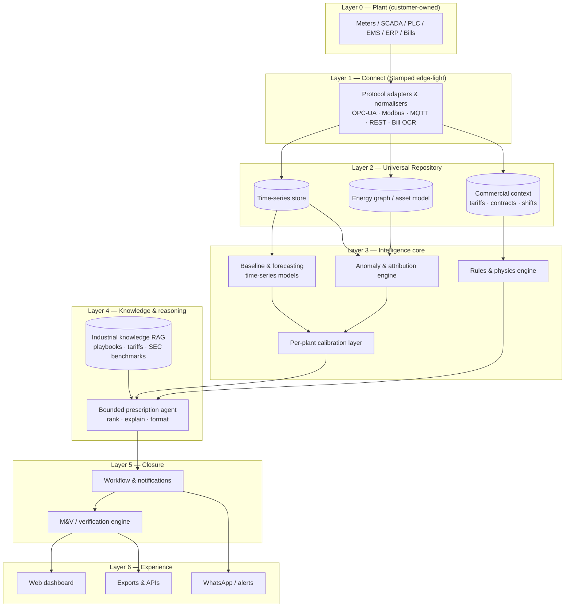

# Stamped Energy — Product Definition & High-Level Architecture

*Version 0.3 | August 2026*  
*Status: Pre-build architecture — high-level only. Refine after pilot integration reality checks.*  
*Client narrative:* [Client Positioning & Narrative v1](/core-product/Stamped_Client_Positioning_and_Narrative_v1.md) · *Engineering SSOT:* [`external/technical/STAMPED_ARCHITECTURE.md`](/external/technical/STAMPED_ARCHITECTURE.md) · *Research companion:* [Two-Pillar Technical Framing v1](/core-product/Stamped_Two_Pillar_Technical_Framing_v1.md)

> **Honesty convention:** `[~]` approximate / benchmark-derived · `[!]` evolving — verify before customer-facing claims

---

## 1. Executive summary

**Stamped Intelligence** (company: Stamped Energy) is a **read-only operational decision layer** for Indian energy-intensive manufacturers (≥ ₹30L/month electricity per plant). It **manages load and energy in real time**, applies **ML models calibrated to plant equipment baselines**, and uses an **agentic prescription layer** to turn findings into **assigned actions with ₹ impact** — **verified with evidence** from Stamped’s tracking stack (DISCOM bill confirmation optional). Sits on meters, SCADA, PLCs, EMS exports, bills, optional ERP/MES orders — without replacing Industry 4.0, EMS, MES, or CMMS.

**Client narrative canon:** [Client Positioning & Narrative v1](/core-product/Stamped_Client_Positioning_and_Narrative_v1.md).

This document defines **what the product provides** and **how it is architected at a high level** — where time-series models, custom per-plant models, rules/physics engines, knowledge graphs, RAG, and bounded agentic systems each belong. It synthesizes Stamped's own product thesis, the [stamped.work](https://stamped.work/) positioning, the [demo dashboard](https://stamped-energy.vercel.app/), and competitor technical patterns (Greenovative, Zerowatt, PredCo, Infinite Uptime, OEM incumbents).

**Core architectural bet:** Stamped wins on the **decision and closure layer**, not on being the best monitoring dashboard or a hardware company. Intelligence must produce **prescriptions a supervisor can execute**, not charts a plant head opens once a month.

---

## 2. Product definition

### 2.1 What Stamped is

| Dimension | Definition |
| --- | --- |
| **Category** | Prescriptive energy + equipment intelligence / verified-with-evidence operational decision layer |
| **Buyer outcome** | Verified ₹ / SEC reduction with evidence; plant effectiveness co-benefits on management Rx when context exists |
| **Integration stance** | Read-only overlay on OT/IT — no control writes, no hardware retrofit program |
| **Operating loop** | Connect → Observe → Decide → Execute → Verify → Improve |
| **Differentiator** | Closed-loop accountability — potential vs realised savings, not passive EMS |

Stamped is **not**: a generic EMS dashboard, ESG/carbon accounting platform, SCADA replacement, **MES**, **CMMS**, or **vibration** predictive-maintenance company. It **does** deliver **Prescriptive Equipment Intelligence** from electrical / process / runtime data (early warnings and maintenance-executable prescriptions) as a technical section alongside load and energy efficiency — **exactly two pillars** plus shared plant context (orders/trade-offs; effectiveness/OEE as co-benefits) — see [Two-Pillar Technical Framing v1](/core-product/Stamped_Two_Pillar_Technical_Framing_v1.md). Third-party vibration / motor-current signature feeds may be consumed later where present.

### 2.2 What the product provides (capability modules)

These are the **product surfaces** a customer buys — mapped to outcomes, not engineering components. Grouped for technical storytelling under two pillars (marketing category is evidence-verified energy decision layer).

**Shared**

| Module | What it does for the plant | Primary data need |
| --- | --- | --- |
| **1. Universal connect** | Pulls incomer meter, bill, SCADA/PLC/EMS, production tags into one pipeline | Path A: full OT · Path B: meter + bill first |
| **6. Prescription engine** | Ranked actions: What / Why / Who / Effort / ₹ Impact / When | All above + domain knowledge |
| **7. Execution & governance** | Work items, owner assignment, WhatsApp + dashboard, status tracking | Workflow store |
| **8. Savings verification (M&V)** | Potential vs realised ledger; bill reconciliation; IPMVP-style narrative `[~]` | Post-action telemetry + bill |
| **9. Multi-plant benchmark** `[!]` | Cross-site SEC/MD comparison for groups (e.g. forging vs forging) | Normalised metrics across sites |
| **10. Sustainability evidence export** | SEC trends, realised savings, intensity — feeds corporate ESG tools | Verified operational data |

**Pillar 1 — Load & Energy Efficiency Intelligence**

| Module | What it does for the plant | Primary data need |
| --- | --- | --- |
| **2. Baseline & SEC intelligence** | Production-normalised baselines — kWh/part, kWh/ton, kWh/shift, MD by window | Meter + production context |
| **3. Demand intelligence** | Attributes MD spikes to assets/events; prescribes stagger, shed, reschedule | Incomer + asset states |
| **4. Tariff & contract intelligence** | CMD sizing, TOD exposure, PF penalties, source-mix dispatch (grid/solar/WHR/DG) | Bill + tariff order + meters |
| **5a. Utility waste (ops)** | Idle loads, holding, off-shift HVAC, pressure setpoints — actions are schedule/shutdown/setpoint | Meter trends + shift schedule |

**Pillar 2 — Prescriptive Equipment Intelligence**

| Module | What it does for the plant | Primary data need |
| --- | --- | --- |
| **5b. Equipment-health prescriptions** | Specific-power drift, trip/duty patterns, fouling/filter proxies → inspect/clean/tune (maintenance-executable); not vibration RUL | Meter/SCADA trends + asset state |

### 2.3 User-facing experience (from website + demo dashboard)

The **primary UX is not a kWh chart**. Reference surfaces:

**A. Prescription card (hero artifact)**  
Structured action the maintenance supervisor receives — matches stamped.work sample and demo dashboard "Action Intelligence" panel:
- What · Why · Impact (₹ + optional tCO₂e) · Owner · Due · Priority

**B. Plant head / energy manager dashboard** `[demo: stamped-energy.vercel.app]`  
- Savings ledger (verified M&V)  
- 30-day trend vs Stamped baseline  
- Equipment health map (load %, status by asset)  
- Live anomaly feed (critical → info)  
- Top consumers table with benchmark deviation  
- TOD / 24h demand profile  
- Prescription queue with total addressable ₹

**C. Floor channel**  
- WhatsApp alerts for actionable prescriptions  
- Optional mobile-responsive web for acknowledgment

**D. Executive / sustainability export**  
- PDF report, realised vs potential rollup  
- SEC/intensity series for PAT, BRSR, OEM supplier audits

### 2.4 Integration paths (product, not engineering)

| Path | Entry | Week-1 value | Maturity arc |
| --- | --- | --- | --- |
| **Path A — Direct OT** | SCADA, PLC, CNC, feeder meters, ERP where accessible | Machine-level attribution, shift SEC, rich prescriptions | Default for ICP (≥ ₹30L/mo) |
| **Path B — Meter-up** | Incomer meter + 6 months bills | MD pattern, PF, TOD waste, bill-level Rx | Stage 2: sub-meters · Stage 3: PLC/SCADA |

**Governing principle:** Real prescriptions from day one at the customer's integration level. Depth grows with data; value starts immediately.

---

## 3. Competitive architecture learnings

Synthesis from `competitor-research/` and `industry-market-research/Industrial_AI_Synthesis.md`. Informs Stamped's build choices — not copy-paste.

### 3.1 Pattern comparison

| Player | Architecture paradigm | AI approach | Stamped takeaway |
| --- | --- | --- | --- |
| **Greenovative** | Cloud SaaS · Universal Repository · energy graph · 4 layers (ingest → repo → contextual AI → closed-loop) | Base industrial model + per-plant parameterisation; anomaly + dispatch optimisation; MILP/rules for source mix | **Adopt:** two-layer model (fleet base + plant adapt), energy graph, closed-loop governance. **Skip early:** full digital twin / SLD for SME wedge |
| **Zerowatt (ZOE)** | Hybrid edge + cloud · AI + **rule expert system** · conversational layer | Time-series anomaly + domain rules + RAG knowledge base; IPMVP M&V; logbook learning | **Adopt:** rules + physics heuristics for explainable Rx; RAG over audit playbooks; WhatsApp delivery. **Differentiate:** software-only, no proprietary meter hardware |
| **PredCo** | Air-gap edge GPU → plant K8s → enterprise cloud | CV + fine-tuned LLMs for compliance; deterministic rules engine backing LLM outputs | **Adopt:** rules-first for prescriptions; LLM only where unstructured (tariff PDFs, SOPs). **Skip:** CV/safety stack (out of scope) |
| **Infinite Uptime** | Proprietary sensors → vertical vibration models → prescriptive CMMS | Industry-specific classifiers; human-in-loop flywheel; agentic "Trust Loop" with guardrails | **Adopt:** multi-persona outputs (supervisor vs plant head vs CFO); HITL feedback on prescription quality. **Skip:** hardware PdM core |
| **Siemens / Schneider / ABB** | Hardware-bundled EMS, siloed by vendor | Mature monitoring; prescriptive AI emerging at enterprise tier | **Position:** agile decision layer on top of their EMS — "prescribe + verify", not rip-and-replace |
| **C3.ai** (intl. ref.) | Enterprise AI platform, broad use cases | Generic ML on industrial data | **Avoid:** horizontal platform scope; stay energy-decision narrow |

### 3.2 What the market already proves

1. **Prescriptive beats descriptive** — dashboards are table stakes; willingness-to-pay is on assigned action + verification (Greenovative, Zerowatt, Infinite Uptime all converge here).  
2. **Two-layer intelligence works** — cross-plant base patterns + per-facility calibration (Greenovative, Zerowatt logbook learning).  
3. **Rules + ML hybrid** — explainable prescriptions for operators require domain rules, not black-box ML alone (Zerowatt, PredCo).  
4. **Evidence verification is the trust anchor** — ops-cleared / calculated potential vs realised ledger is primary; IPMVP-style narrative; DISCOM bill can confirm (Zerowatt, Stamped website).  
5. **WhatsApp is a product surface** in India — not an afterthought (Zerowatt, Stamped GTM).  
6. **Agentic AI belongs behind guardrails** — autonomous plant control is not phase 1; orchestration of human workflows is (Infinite Uptime Trust Loop, Stamped founder philosophy).

---

## 4. High-level technical architecture

### 4.1 Architecture diagram



### 4.2 Layer-by-layer definition

#### Layer 0 — Plant systems (out of Stamped's control)

Customer-owned OT/IT: incomer and feeder meters, SCADA historians, PLCs, CNC gateways, EMS exports, ERP production data, DISCOM bill PDFs. Stamped connects **read-only**.

#### Layer 1 — Connect & normalise

**Purpose:** Protocol-agnostic ingestion without replacing customer infrastructure.

| Component | Role |
| --- | --- |
| Edge-light gateway `[!]` | Optional on-plant agent for OPC-UA/Modbus when cloud VPN is unacceptable; buffers and normalises |
| Stream normaliser | Maps vendor tags → canonical schema (kW, kVA, PF, equipment state, production count) |
| Bill ingest | PDF/OCR + structured tariff parsing |
| Identity & tagging | Plant → line → asset → meter point hierarchy seed |

**Deployment options:** Plant LAN gateway **or** cloud ingest over VPN — customer IT choice `[!]`.

#### Layer 2 — Universal Repository ("energy graph")

Greenovative calls this the **Universal Energy Repository**. For Stamped it is two coupled structures:

| Store | Contents | Why |
| --- | --- | --- |
| **Time-series DB** | High-frequency telemetry, aggregates, baselines, anomaly scores | MD curves, SEC, shift patterns, M&V |
| **Energy graph** | Asset topology: plant → system → equipment → meter points; relationships (feeds, drives, shares bus) | Root-cause attribution ("Compressor 1 + Furnace 2 caused 07:15 spike") |
| **Commercial context** | DISCOM tariff orders, CMD, TOD windows, shift calendar, product mix | ₹ impact calculation |

The graph is **not** a full digital twin in v1 — it is the **minimum topology** needed to attribute waste and route prescriptions to the right owner.

#### Layer 3 — Intelligence core (deterministic + ML)

Where **numeric intelligence** lives. Outputs **signals and scored events**, not user-facing prose.

| Engine | Technique | Input | Output |
| --- | --- | --- | --- |
| **Baseline engine** | Time-series: seasonal decomposition, regression on production covariates, quantile bands `[~]` | Historical kW/kVA + production tags | Expected consumption band per asset/shift/product |
| **Forecast / scenario** | Short-horizon demand forecast; what-if load shift `[~]` | Baseline + schedule | Predicted MD, TOD exposure |
| **Anomaly detector** | Multivariate time-series anomaly (statistical + ML); context-aware (suppress startup spikes) | Actual vs baseline | Anomaly events with severity |
| **Attribution engine** | Graph traversal + temporal correlation | Anomaly + energy graph + asset states | Candidate root causes ranked |
| **Rules & physics engine** | Domain rules + equipment curves (compressor SP, furnace holding, PF thresholds) | Telemetry + graph + commercial context | Structured finding objects (machine-readable) |
| **Per-plant calibration** | Parameter layer adapting fleet defaults — thresholds, SEC norms, shift definitions | 4–8 weeks plant data | Plant-specific model config (not full retrain per site) |

**Custom model vs shared model:**

| Model class | Shared (fleet) | Custom (per plant) |
| --- | --- | --- |
| Waste pattern signatures | ✓ Trained/indexed across verticals | Calibrated thresholds |
| SEC / MD baselines | ✓ Vertical priors from benchmarks `[~]` | ✓ Production mix, asset roster |
| Tariff / dispatch rules | ✓ DISCOM order templates | ✓ Contract CMD, source mix |
| Anomaly sensitivity | ✓ Base detectors | ✓ Noise profile, shift calendar |

#### Layer 4 — Knowledge & prescription reasoning

Where **language, context, and ranking** turn signals into **prescriptions**.

| Component | Technique | Role |
| --- | --- | --- |
| **Industrial knowledge RAG** | Vector retrieval over curated corpus: SEC benchmarks, audit playbooks, DISCOM tariff docs, OEM SOPs, Zerowatt-style waste categories, vertical guides | Ground "Why" and "What" in defensible domain text; avoid hallucinated maintenance steps |
| **Prescription agent** (bounded) | LLM + tool calls to: query graph, pull anomaly evidence, compute ₹ impact, select owner role from asset map, format card | Generates prescription JSON — **does not** write to SCADA |
| **Ranker** | ROI × urgency × effort × confidence | Orders prescription queue |

**RAG corpus (initial):** `external-learning/zerowatt/`, vertical x-rays, DISCOM tariff orders, IPMVP M&V guidance, internal prescription templates.

**Graph vs RAG — division of labour:**

| Question type | System |
| --- | --- |
| "Which assets contributed to the 07:15 MD spike?" | **Energy graph** + time-series attribution |
| "What is the standard remedy for intercooler fouling on a 2-stage compressor?" | **RAG** (playbook) |
| "What is the ₹ impact of staggering Furnace 2 by 10 minutes this month?" | **Rules engine** + tariff context |
| "Draft the prescription card for the electrical supervisor" | **Bounded agent** (template + evidence) |

#### Layer 5 — Closure & verification

| Component | Role |
| --- | --- |
| **Workflow engine** | Open → In Progress → Done / Deferred / Rejected; owner, due date, audit trail |
| **Notification router** | WhatsApp, email, dashboard — role-based |
| **M&V engine** | Compare post-action period vs adjusted baseline; reconcile with bill MD/energy lines |
| **Savings ledger** | Running potential vs realised ₹; export for CFO / sustainability |

#### Layer 6 — Experience layer

| Surface | Primary user |
| --- | --- |
| Web dashboard | Plant head, energy manager |
| Prescription detail / queue | Supervisors, maintenance |
| WhatsApp | Floor execution |
| PDF / CSV export | Sustainability, OEM audits, leadership |

---

## 5. AI / ML component map (single view)

| Capability | Primary technique | Secondary | Phase |
| --- | --- | --- | --- |
| Ingestion & normalisation | Protocol adapters, schema mapping | — | P0 |
| Baseline & SEC | Time-series regression, seasonal models | Fleet vertical priors | P0 |
| MD / demand spike detection | Time-series + peak detection | Shift calendar context | P0 |
| Anomaly detection | Statistical + ML multivariate | Per-plant calibration | P0 |
| Root-cause attribution | Energy graph + correlation | Rules engine | P0 |
| ₹ impact calculation | Deterministic tariff engine | — | P0 |
| Prescription text & ranking | Bounded LLM agent + templates | RAG for "Why" | P0 |
| Tariff / bill parsing | OCR + LLM extraction | Rules validation | P0 |
| Source dispatch (grid/solar/WHR) | MILP or rule solver `[~]` | Greenovative pattern | P1 |
| Conversational query ("why was SEC high Tuesday?") | RAG + tool-using agent | Time-series charts as tools | P1 |
| Cross-plant benchmark | Aggregated analytics | Anonymised fleet learning | P1 |
| Prescriptive Equipment Intelligence (electrical/process) | Rules + anomaly on meters/SCADA (specific-power drift, trip/duty) | First-class product section — see Two-Pillar Technical Framing v1 | P0–P1 |
| Vibration / motor-current signature fusion | Consume third-party PdM signals | Not built in-house | P2 |
| Auto SCADA write-back | — | **Explicitly out of scope** | — |

### 5.1 Agentic system — scope and guardrails

**What "agentic" means for Stamped (phase 1):**

An orchestrator that **plans prescription drafts** by calling tools:
- `query_timeseries(asset, window)`
- `get_baseline(asset, shift)`
- `traverse_graph(asset_id)`
- `lookup_playbook(symptom)`
- `calculate_rupee_impact(action, tariff)`
- `assign_owner(asset, role_map)`

**Guardrails:**
- Read-only on OT — no autonomous setpoint changes  
- Every prescription cites evidence pointers (meter tag, timestamp, baseline delta)  
- High-impact or ambiguous actions → human approval before send  
- Deterministic rules engine can **veto** agent output that violates physics/tariff constraints  
- Full audit log for OEM / ISO energy reviews

**What agentic is NOT in v1:** closed-loop autonomous plant control, self-modifying SCADA logic, unbounded chat without tool grounding.

---

## 6. Data flows — three exemplar prescriptions

### 6.1 Monday MD spike (die casting / forging classic)

```
Incomer kVA spike @ 07:12
  → Baseline: expected MD for shift-start sequence
  → Attribution: HT Furnace 3 preheat ∩ Forging Line 2 ramp (graph + timestamps)
  → Rule: stagger ≥8 min reduces overlap probability
  → ₹ engine: CMD × demand charge × monthly reset
  → Agent: format prescription → assign Electrical Supervisor
  → WhatsApp + dashboard
  → M&V: next bill MD line + incomer profile
```

### 6.2 Compressor specific power drift

```
Compressor feeder kWh ↑ at same pressure band (3 weeks)
  → Anomaly vs per-plant baseline
  → Rule match: inlet filter / intercooler fouling signature
  → RAG: playbook steps, effort estimate
  → ₹ engine: SEC delta × run hours
  → Prescription: "Clean inlet filter — 2 hr job"
```

### 6.3 WHR / solar dispatch opportunity

```
Peak window 18:00–22:00; WHR output available; grid import high
  → Source mix rule engine
  → ₹ engine: TOD tariff delta
  → Prescription: "Increase WHR draw 2.1 MW; reduce grid import"
  → Owner: dispatch coordinator
```

---

## 7. Deployment & tenancy model

| Aspect | Stamped choice `[!]` |
| --- | --- |
| **Tenancy** | Multi-tenant SaaS; per-plant data isolation |
| **Compute** | Cloud-primary; optional plant gateway for air-gapped OT |
| **Data residency** | India region preferred for enterprise accounts |
| **Security** | Read-only OT, TLS, RBAC, audit logs; ISO 27001 as scale milestone |
| **Time to first Rx** | ≤ 2 weeks (Path B bill+meter); richer with Path A |

---

## 8. Build phasing (architecture milestones)

| Phase | Objective | Architecture delivered |
| --- | --- | --- |
| **P0 — Pilot wedge** | MD + bill + incomer prescriptions verified with evidence (ops-cleared ledger) | Connect, TS store, baseline, MD engine, rules, Rx agent, workflow, M&V, WhatsApp |
| **P1 — Path A richness** | Machine-level SEC, shift attribution, multi-asset graph | Full graph, PLC/SCADA connectors, attribution, cross-shift baselines |
| **P2 — Fleet** | Multi-plant benchmark for groups | Fleet analytics, anonymised priors, executive rollups |
| **P3 — Depth** | Source dispatch optimisation, conversational analyst | MILP dispatch, RAG chat with tool use |

---

## 9. Explicit non-goals (architecture)

- Proprietary sensor hardware (Infinite Uptime / Zerowatt meter path)  
- Full digital twin / 3D plant model (Greenovative SLD — defer)  
- ESG / Scope 1-3 accounting platform (export to existing tools only)  
- Safety / compliance CV (PredCo lane)  
- Autonomous closed-loop SCADA control in v1  
- Public developer API / marketplace in v1  

---

## 10. Architecture principles (founder bets)

From Two-Pillar Technical Framing v1 and master document — these constrain all technical decisions:

1. **Software-first** — value from integration + intelligence, not hardware margin  
2. **Insight → action → savings** — optimise for closure, not chart count  
3. **Physics-informed over generic ML** — encode thermodynamics, tariff logic, equipment behaviour  
4. **Explainability for the shop floor** — supervisors need "what and why", not model scores  
5. **Evidence as source of truth** — models propose; Stamped telemetry + calculation stack verifies; DISCOM bill can confirm  
6. **Infrastructure-adaptive** — same product architecture serves Path A and Path B with capability flags  

---

## 11. Open architecture questions `[!]`

Validate in first 3 pilots:

1. Edge gateway vs VPN-only — what % of ICP plants allow cloud-bound OT streams?  
2. Graph modelling effort per plant — can we template by vertical (forging, die casting, cement kiln) vs custom SLD?  
3. Rules vs ML split — which prescription types are 100% rule-covered (MD stagger) vs need ML (SEC drift)?  
4. RAG freshness — how often do DISCOM tariff orders change vs static playbooks?  
5. M&V defensibility — IPMVP Option B/C fit for Indian bill-only verification at Path B?  

---

## 12. References

| Source | Path / URL |
| --- | --- |
| Master product doc | `core-product/Stamped_Energy_Master_Document_v1.4.md` |
| Technical framing | `core-product/Stamped_Two_Pillar_Technical_Framing_v1.md` |
| Greenovative architecture learning | `external-learning/greenovative/02-platform-capabilities-and-architecture.md` |
| Competitor technical reports | `competitor-research/*_Technical_Research_Report.md` |
| Industrial AI synthesis | `industry-market-research/Industrial_AI_Synthesis.md` |
| Demo dashboard | https://stamped-energy.vercel.app/ |
| Marketing site | https://stamped.work/ |
| Shivam technical storytelling | `prospective-clients/shivam-autotech/05-technical-storytelling.md` |

---

*Next revision: after first pilot integration spec is drafted — add connector priority list and canonical data schema.*
