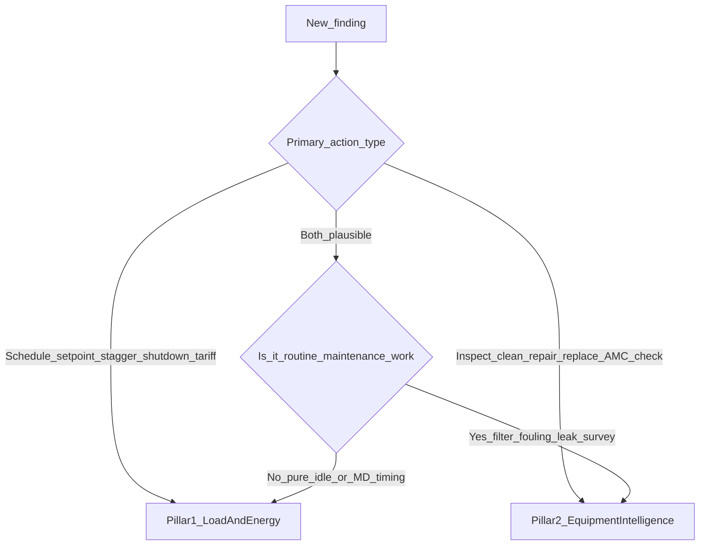
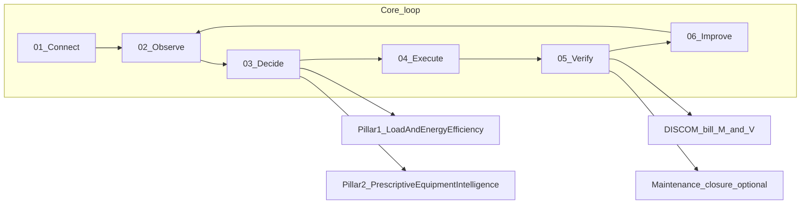
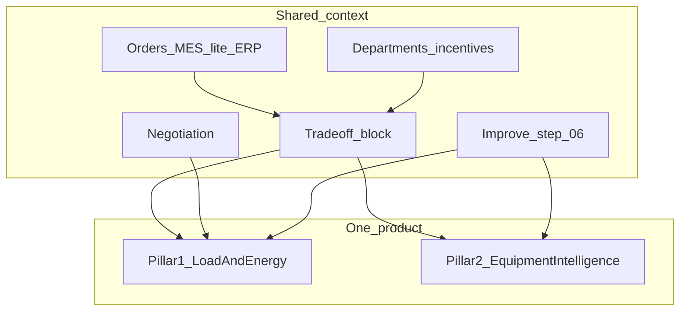

# Stamped Energy — Two-Pillar Technical Framing (v1)

*Status: Working technical canon for founder calls, decks, and engineering alignment.*  
*Supersedes earlier co-equal “predictive maintenance” GTM drafts (Two-Pillar Value Model v0.1 and its red-team — removed; see git history).*  
*Honesty:* `[~]` approximate · `[!]` evolving — validate on pilots before customer guarantees.

**Framing lock (2026-07-30, synced 2026-08-02):** **One product. Exactly two outcome pillars. Shared plant context is not a third pillar and not an MES product.** Platform ADR: [`external/decisions/024-026/ADR-026-two-pillars-shared-context.md`](/external/decisions/024-026/ADR-026-two-pillars-shared-context.md).

**Related:** [Client Positioning & Narrative v1](/core-product/Stamped_Client_Positioning_and_Narrative_v1.md) · [Master Document v1.6](/core-product/Stamped_Energy_Master_Document_v1.4.md) · [Product Definition](/core-product/Stamped_Product_Definition_and_Architecture.md) · [Energy-efficiency KB](/knowledge/energy-efficiency/index.md) · Platform SSOT: [`external/technical/STAMPED_ARCHITECTURE.md`](/external/technical/STAMPED_ARCHITECTURE.md) · ADR-024 · ADR-025 · ADR-026

---

## 1. Core value (client narrative + marketing hero)

**Canonical client story (order matters):** See [Client Positioning & Narrative v1](/core-product/Stamped_Client_Positioning_and_Narrative_v1.md) — (1) load & energy management in real time, (2) equipment ML on plant baselines, (3) prescriptions + verify, (4) agentic layer alongside. Lead with outcomes; agentic is step 4, not the headline.

Stamped is a **read-only, software-first decision layer** on plant meters, SCADA, and DISCOM bills that turns fragmented electrical and process data into **ranked, assigned prescriptions** — primarily to **manage load and energy in real time** (stagger, idle waste, utilities, ToD, MD — not MD alone), and secondarily to surface **equipment-health early warnings** via **ML models calibrated to plant baselines** — then **verifies with evidence** from Stamped’s tracking stack (telemetry clearance + potential/realised ledger). DISCOM bill confirmation is optional secondary proof; maintenance closure can also close Pillar 2.

**Named outcomes (both must appear in product thinking):**

| Outcome | Role |
| --- | --- |
| **Energy efficiency** | Hero — ₹ / SEC / bill lines |
| **Plant effectiveness** | Co-benefit — OEE / order-on-time / downtime risk on management prescriptions when order context exists — **not** Pillar 3 |

**Outward category (website, cold openers, Ideal Customer Profile):** evidence-verified operational / energy decision layer — AI-driven energy cost savings, energy efficiency, and sustainability evidence as a by-product. Lead with **verified with evidence**, not “evidence-verified.” **Not** a computerized maintenance management system, vibration predictive-maintenance company, EMS replacement, **MES**, or solar/EPC vendor.

**On technical calls and decks only:** Stamped Intelligence has **exactly two** sections under one loop — (1) **Load & Energy Efficiency Intelligence**, (2) **Prescriptive Equipment Intelligence** — plus **shared context** (orders, departments, trade-offs, negotiation, Improve).

| Surface | What changes |
| --- | --- |
| Website / cold outreach / WhatsApp | **Load & energy in real time** first; equipment ML baselines; prescriptions; agentic layer **alongside** (not “under the hood”). Proof = **verified with evidence**. See [Client Positioning v1](/core-product/Stamped_Client_Positioning_and_Narrative_v1.md). |
| Technical presentation / discovery deep-dive | Structure the product into the two pillars below + one agentic architecture slide |
| Commercial offer | **60-Day Proof Run** (Pillar 1 evidence proof primary; bill optional) |

---

## 2. Locked names and grey-zone rule

| Item | Lock |
| --- | --- |
| **Product shape** | **One** product — do not split into Energy / Maintenance / MES products |
| **Pillar 1** | **Load & Energy Efficiency Intelligence** |
| **Pillar 2** | **Prescriptive Equipment Intelligence** (spell out; short form only after first expansion in a doc) |
| **Third pillar** | **Forbidden** — no MES / Production / OEE pillar |
| **Shared context** | Orders (ERP/MES/MES-lite), departments, trade-off block, negotiation, Improve — enablers of practical Rx |
| **Grey-zone** | **Pure energy outcome → Pillar 1.** **Routine maintenance work that also saves energy → Pillar 2.** |
| Examples | Sunday idle bay burn (no repair) → Pillar 1. Compressor filter clean from kilowatt drift → Pillar 2. |
| Primary commercial wedge | Pillar 1 (load / tariff / bill) first in most buyer stories |
| Pillar 2 role | Second technical section; downtime / equipment health is secondary outcome, not co-equal brand |
| Effectiveness / OEE | Co-benefit on management Rx cards — not a separate product |

### Grey-zone decision tree

---

## 3. Core loop (01–06)

Same loop for both pillars. Step **06 Improve** closes the flywheel (acted vs ignored prescriptions + verified outcomes → better ranking and calibration). Human-in-the-loop; read-only on OT.

| Step | Name | What happens |
| ---: | --- | --- |
| 01 | **Connect** | Integrate with systems and meters (and bills). |
| 02 | **Observe** | Normalise and analyse patterns (baselines, coincidence, drift). |
| 03 | **Decide** | Ranked prescriptions with ₹ impact and/or risk — Pillar 1 and/or Pillar 2 engines. |
| 04 | **Execute** | Assign actions to the team; track via WhatsApp and dashboard. |
| 05 | **Verify** | Ops-cleared / calculated M&V → potential vs realised ledger; DISCOM bill optional (Pillar 1); maintenance closure optional (Pillar 2) |
| 06 | **Improve** | Learn from correct / incorrect / ignored actions; tighten baselines and rule packs. |

**Real-time stance:** near-real-time for **maximum demand spike windows and actionable alerts** (minutes). Batch / shift for drift and bill measurement and verification. Do **not** claim continuous plant-wide autonomous real-time control — data volume and read-only OT make that false.

---

## 4. Signal → decision → what the buyer sees

| Stage | Source | Output the plant sees |
| --- | --- | --- |
| Signals | Incomer and feeder meters, SCADA/PLC tags, production/shift calendar, DISCOM bills and tariff | — |
| Observe | Canonical time-series + asset graph + commercial context | Baselines, coincidence windows, drift bands |
| Decide (Pillar 1) | Demand, tariff, pure-waste, thermal-timing, source-mix engines | Prescription: stagger / shed / schedule / setpoint / tariff action + ₹ |
| Decide (Pillar 2) | Specific-power drift, trip/duty, coarse signature engines | Prescription: inspect / clean / tune / check + risk + optional ₹ |
| Execute | Workflow store | Named owner, WhatsApp card, status |
| Verify | Bill reconcile; optional maintenance log | Ledger: potential vs realised |
| Improve | Acted / deferred / rejected + outcome | Better ranks next cycle |

**Shared (not a third pillar):** data plane, prescription card format (What / Why / Who / Effort / Impact / When), WhatsApp assignment, owner tracking, Improve loop — plus the **shared plant context** in §4b.

---

## 4b. Shared plant context (not a pillar, not MES)

Holistic practicality work lives here. Sell it as **how we keep prescriptions usable in a real multi-department plant** — never as a third product.

| Context element | What it does | Do not claim |
| --- | --- | --- |
| Production orders (ERP / MES / CSV MES-lite) | Due dates for deadline-aware stagger / TOD / shed | We own dispatch or WIP |
| Department / line graph | Owners, incentives, upstream/downstream | Org-chart / HR product |
| Trade-off block | ₹ energy (hero) + OEE / order / downtime co-benefits | Separate OEE product |
| Prescription negotiation | Bounded revise under supervisor constraints | Free-form plant control agent |
| Improve (loop 06) | Learn from acted vs ignored | Silent auto-retrain without review |

**Platform specs (stamped-external v2026.08.01):** [ADR-024](/external/decisions/024-026/ADR-024-holistic-plant-decisions.md) (holistic decisions, trade-off block, negotiation) · [ADR-025](/external/decisions/024-026/ADR-025-improve-loop-step-06.md) (Improve) · [ADR-026](/external/decisions/024-026/ADR-026-two-pillars-shared-context.md) (framing lock) · handoffs under `external/handoff/holistic/`.

**30-second pitch:**

1. Cut **energy cost** with assigned, evidence-verified actions (Pillar 1).  
2. Same stack flags **equipment issues early** (Pillar 2).  
3. Schedule-type actions read **orders/departments** so we do not break production — **not your MES**.  
4. Management Rx show **₹** plus **effectiveness co-benefits** when context exists.

---

## 5. Pillar 1 — Load & Energy Efficiency Intelligence

**Job:** Keep billing demand and peak / time-of-day exposure under control, cut pure energy waste, and improve commercial **efficiency** — without killing production (**effectiveness** co-benefits via shared order/department context on management actions).

**Proof:** DISCOM maximum demand, energy, and power factor lines; specific energy consumption where production tags exist.

### 5.1 Market product types (context, not competitors to copy)

| Product type | Example class | Control model | Stamped stance |
| --- | --- | --- | --- |
| Peak levelling / sequential start | INEA inGenious Peak–class | Closed-loop write | **Prescribe** stagger/shed; do not auto-write OT in v1 |
| Flexibility / multi-asset orchestration | etalytics / Enit–class | Automated EMS | Later prescription lists; auto control later |
| Battery + time-of-day + maximum demand (India HT) | EnerCog–class | Hardware + software | Adjacent; differentiate **ops without battery capex** |
| AI demand agents (building management native) | Wattif–class | Auto dispatch | Borrow metaphors (thermal mass, stagger); not our delivery |
| Prescriptive energy intelligence (India) | Zerowatt, Greenovative | Advisory + governance | **Closest peers** — Stamped stays here |
| Computerized maintenance + energy content | Oxmaint–style | Portal / work orders | Bundle pattern only |

### 5.2 Technique families A–E

#### A. Peak and coincidence management (capacity / maximum demand line)

| Technique | Plain meaning | Stamped fit |
| --- | --- | --- |
| Peak forecasting | Predict billing-window maximum demand before it locks | **P0** prescribe + alert |
| Spike post-mortem / attribution | Which feeders or assets caused last spike | **P0** |
| Load staggering / sequencing | Desynchronise large starts inside 15/30-minute window | **P0** (same-section first) |
| Load shedding (non-critical) | Temporary curtail auxiliaries during predicted spike | **P0** human-confirm; soft auto later |
| Peak shaving (hardware-assisted) | Battery / diesel cover the tip of the peak | Diagnose + refer — not a battery EMS |
| Soft maximum demand / contract demand target | Operate under a plant-chosen kilovolt-ampere ceiling | **P0–P1** |

#### B. Time and tariff intelligence (commercial efficiency)

| Technique | Stamped fit |
| --- | --- |
| Time-of-day shifting | **P0–P1** prescribe |
| Contract demand right-sizing | **P0** from bills |
| Load-factor diagnostics | **P1** |
| Power factor ops before capacitor-bank capex | **P0** diagnose + prescribe; new panels = refer |
| Bill measurement and verification ledger | **P0** mandatory |

#### C. Thermal and process timing (“heat effort” class)

Uses **thermal inertia** — pre-heat / pre-cool / hold setback — so peaks and time-of-day cost drop without cutting output.

| Technique | Example | Stamped fit |
| --- | --- | --- |
| Preheat / precool scheduling | Furnace, oven, paint booth, HVAC just-in-time vs early stack | **P0–P1** Pillar 1 |
| Hold / soak setback | Drop hold over lunch, breaks, empty batches | **P0** Pillar 1 |
| Thermal storage / ice bank / heat battery | Charge off-peak, discharge on-peak | **Defer / partner** (capex); detect opportunity from load + time-of-day |
| Batch–time-of-day alignment | Energy-heavy batches in cheaper slots | **P1** (needs production calendar) |

#### D. Pure energy waste (no failure story → Pillar 1)

| Technique | Example | Stamped fit |
| --- | --- | --- |
| Idle / off-shift kill | CNC, compressors, rectifiers on with zero production | **P0** |
| Artificial demand (compressed air) | Pressure too high → excess kilowatts | **P0–P1** |
| Off-shift HVAC / air handling / chiller | Cooling empty halls | **P0** |
| Specific energy / specific power as waste KPI | Schedule or setpoint action (not filter clean) | **P0–P1** Pillar 1 |

#### E. Source-mix and on-site generation

| Technique | Stamped fit |
| --- | --- |
| Solar vs grid vs waste-heat recovery vs diesel dispatch | **P1** after maximum demand basics |
| Demand-response program revenue (US/Canada-style) | **Defer** for North India HT vs DISCOM maximum demand / time-of-day |

### 5.3 Map to existing energy-efficiency knowledge levers

Group the eight core levers under families A–E (do not leave them as a flat scatter):

| Knowledge lever | Primary family |
| --- | --- |
| [Demand charges](/knowledge/energy-efficiency/demand-charges/understanding.md) | A |
| [Tariff / contract demand / load factor](/knowledge/energy-efficiency/tariff-cmd-load-factor/understanding.md) | B |
| [Power factor and capacitor banks](/knowledge/energy-efficiency/power-factor-capacitor-banks/understanding.md) | B |
| [Process heat and furnaces](/knowledge/energy-efficiency/process-heat-furnaces/understanding.md) | C (+ D hold waste) |
| [Production scheduling and OEE–energy](/knowledge/energy-efficiency/production-scheduling-oee-energy/understanding.md) | A + C |
| [Idle loads](/knowledge/energy-efficiency/idle-loads/understanding.md) | D |
| [Compressed air and HVAC](/knowledge/energy-efficiency/compressed-air-hvac/understanding.md) | D (ops); Pillar 2 if maintenance survey/filter |
| [Solar and grid mix](/knowledge/energy-efficiency/solar-grid-mix/understanding.md) | E |

### 5.4 Band A emphasis (Pillar 1)

1. Maximum demand forecast + attribution + stagger / shed  
2. Idle / off-shift / holding waste  
3. Time-of-day + contract demand + power factor commercial intelligence  
4. Furnace / oven / HVAC **timing** playbooks (thermal inertia without selling thermal batteries)  
5. Evidence-backed measurement and verification (bill optional)  

**Do not pretend to be:** closed-loop peak controllers, battery dispatch EMS, full flexibility digital twins.

---

## 6. Pillar 2 — Prescriptive Equipment Intelligence

**Job:** Tell maintenance / utilities **which asset is drifting**, **what to check or fix**, **how urgent**, and **what it costs** (energy ₹ and/or downtime risk) — before a hard failure or a month of silent degradation.

**Honest ceiling:** Without vibration, temperature routes, or motor current signature analysis (kilohertz sampling), Stamped will **not** match Infinite Uptime–class “bearing outer race in 14 days, 87% confidence.” That is fine for Band A plants on calendar preventive + reactive breakdown.

### 6.1 Language lock

| Term | Use how |
| --- | --- |
| **Prescriptive Equipment Intelligence** | Canonical name |
| **Prescriptive maintenance** | OK on technical calls (what / who / when / impact) |
| **Predictive maintenance** | Sparingly — market hears vibration / remaining useful life. Prefer “early warning from electrical and process signatures” |
| **Not a vibration predictive-maintenance company** | Hard boundary |

**Predictive vs prescriptive:** predictive ≈ failure window; prescriptive ≈ do *this* action with owner and outcome. Stamped’s loop is already prescriptive; Pillar 2 aims it at **equipment health**, not maximum demand.

### 6.2 Market product types

| Product type | Data plane | Stamped stance |
| --- | --- | --- |
| Vibration / acoustic sensor predictive maintenance | Proprietary sensors | **Not compete**; partner/consume later |
| Motor current / electrical signature analysis | Kilohertz at motor control centre | **Defer / partner** — not from 15-minute meters |
| Computerized maintenance management + predictive module | Sensors + logs + inventory | **Do not become**; optional feed later (P3) |
| Calendar preventive + annual maintenance contract | Little continuous data | Current Band A state — Pillar 2 fills “between visits” |
| Energy-platform equipment health (low frequency) | Existing meters/SCADA | **Stamped’s home** |
| SCADA threshold alarms only | Already in plant | Gap: fatigue, no ₹, no owner, no closure |

### 6.3 Plant maturity ladder

| Level | What exists | Gap Stamped fills |
| --- | --- | --- |
| L0 — Reactive | Fix when broken | First continuous watchlist |
| L1 — Calendar preventive | Time-based annual maintenance contract | Blind between visits |
| L2 — Threshold SCADA alarms | Overload / temp high | Ranked prescription + closure |
| L3 — Spreadsheet energy / ISO 50001 | Monthly specific energy consumption | Link drift → maintenance action |
| L4 — True predictive maintenance | Vibration / Infinite Uptime / motor current signature analysis | Rare; do not replace |

Field thesis `[!]`: most Ideal Customer Profile plants sit at **L0–L2**.

### 6.4 Technique families F–J

#### F. Efficiency drift that implies maintenance (→ Pillar 2 by grey-zone rule)

| Technique | Example prescription | Stamped fit |
| --- | --- | --- |
| Specific-power drift | Compressor kilowatts per air unit up → clean inlet filter | **P0–P1** |
| Utility performance drift | Chiller kilowatts per ton up → inspect fouling | **P1** |
| Pressure vs run-hour leak proxy | Ultrasonic leak survey focus list | **P1** |

#### G. Runtime / duty / trip early warnings

| Technique | Example | Stamped fit |
| --- | --- | --- |
| Trip / overload / soft-start retry clusters | Check before next cascade | **P0–P1** |
| Abnormal duty cycle | Heater on when process idle → inspect / interlock | **P0** (setback alone → Pillar 1) |
| Startup signature change | Longer ramp / more retries → inspect | **P1** — say “inspect,” not bearing remaining useful life |

#### H. Coarse load-signature anomaly (not motor current signature analysis)

| Technique | Stamped fit |
| --- | --- |
| Current imbalance / unexplained continuous draw (if tags exist) | **P1** |
| Feeder always-on vs production | Pillar 1 if shutdown SOP; Pillar 2 if find failed contactor / stuck valve |

#### I. True condition-monitoring science (defer)

| Technique | Stamped fit |
| --- | --- |
| Motor current signature analysis / electrical signature analysis (FFT) | Defer / partner |
| Vibration / ultrasound / oil / thermography | Partner / consume |
| Remaining useful life % confidence | Never claim without that stack |

#### J. Maintenance execution systems (out of product)

| Technique | Stamped fit |
| --- | --- |
| Full computerized maintenance management | Never-build-yet |
| Auto work-order write-back | P3 nice-to-have |
| Displace annual maintenance contract vendors | Avoid — make their visits smarter |

### 6.5 Band A emphasis (Pillar 2)

1. Specific-power / utility drift → inspect / clean / tune  
2. Trip / retry / abnormal duty early warnings  
3. Ranked weekly check-list for Maintenance / Utilities + evidence + optional ₹  
4. Closure via acted prescription + post-fix curve (+ Improve) — not vanity health scores  

**Proof asymmetry**

| Proof | Role |
| --- | --- |
| Maintenance log closed + curve recovery | Primary for Pillar 2 |
| Trip avoided (plant-agreed) | Secondary |
| DISCOM bill line | Co-benefit only — never sole success clause for a Pillar-2-only story |

---

## 7. Deck pattern (two sections, one story)

**Same Connect / Observe → two Decide engines → one Execute / Verify / Improve loop.**

Compressor-house example:

1. **Pillar 1:** “Stagger Compressor 1 vs 2 at shift start — maximum demand ₹.”  
2. **Pillar 2:** “Compressor 2 specific power +18% — clean inlet filter this window.”

### Suggested presentation outline

1. Who we are (evidence-verified energy decision layer — 30 seconds)  
2. Core loop 01–06  
3. **Section A — Load & Energy Efficiency Intelligence** (families A–E highlights for their vertical)  
4. **Section B — Prescriptive Equipment Intelligence** (honest ceiling + 2–3 Rx examples)  
5. Proof: evidence pack / ops-cleared ledger (primary) + DISCOM bill confirmation (optional) + maintenance closure (Pillar 2)  
6. 60-day Proof Run ask  

---

## 8. Relationship to prior docs

| Doc | Status |
| --- | --- |
| This file (v1) | **Working technical canon** for pillars, grey-zone, taxonomies, loop 06 |
| Two-Pillar Value Model v0.1 + Red-Team v0.1 | **Removed** — co-equal predictive-maintenance GTM superseded; retrieve from git history if needed |
| Master Document / messaging canon / cold-call points | Category is evidence-verified; pillars are call/deck structure |

---

## 9. Deferred (not this framing pass)

- Website `/how-it-works` technical pages and model/CNN explainers  
- Mass rewrite of outreach kits  
- Building motor current signature analysis, vibration stacks, or full computerized maintenance management  

---

*End of v1 — iterate with founder field notes; keep marketing category stable while deepening technical two-section storytelling.*
